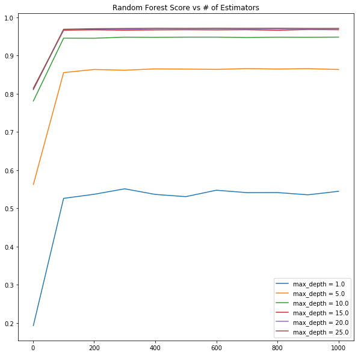
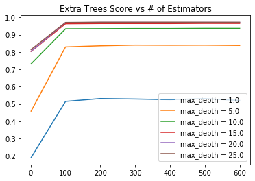
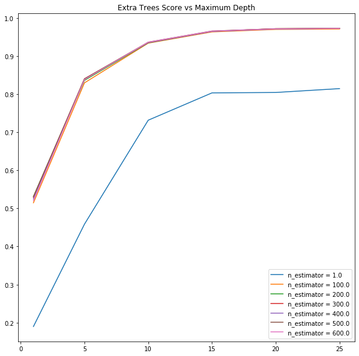

## Machine Learning Ensemble Methods

The projects investigates different ensemble machine learning methods for classification of images of digits using the MNIST dataset.

### Schematic of Ensemble Classifiers

Soft Voting Classifier           |  Stacking Classifier
:-------------------------:|:-------------------------:
  |  

### Hyperparameter Optimization for Individual Classifier

Random Forest classifier
Number of Estimators           |  Maximum Depth of tree
:-------------------------:|:-------------------------:
 | 

Extra Trees Classifier
Number of Estimators           |  Maximum Depth of tree
:-------------------------:|:-------------------------:
 | 

### Accuracy Results 

	
|    Classifier Method    | Test Set Accuracy (%) |    
|:-----------------------:|:---------------------:|   
|      Random Forests     |         96.87         |     
|      Extra Forests      |         97.07         |    
| Support Vector Machines |         96.46         |

|     Ensemble Method    | Test Set Accuracy (%) |
|:----------------------:|:---------------------:|
| Soft Voting Classifier |         97.42         |
|   Blending Classifier  |         97.08         |
